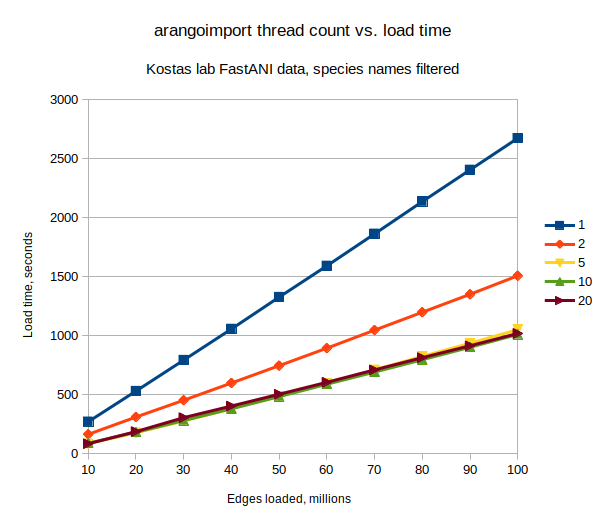
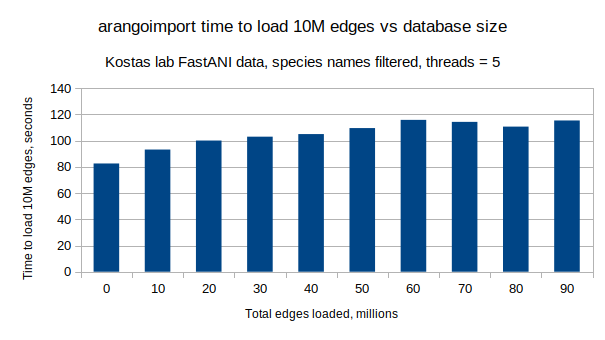
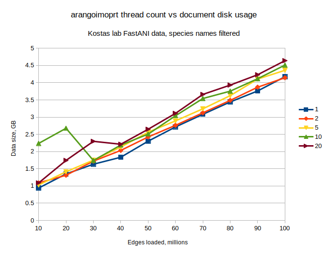
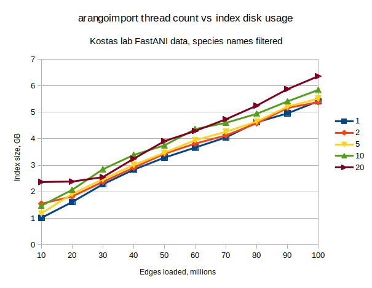
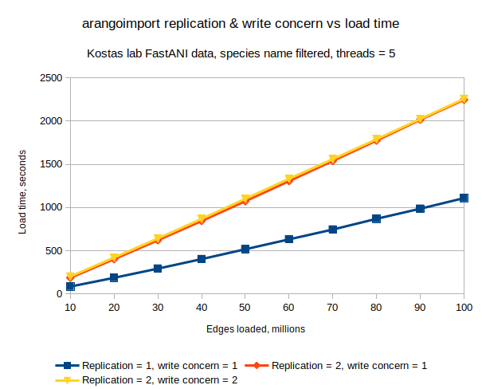
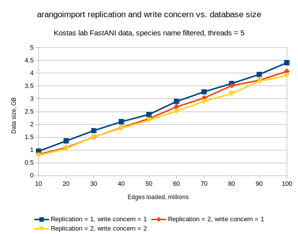
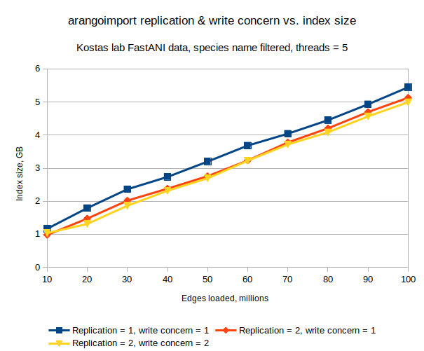
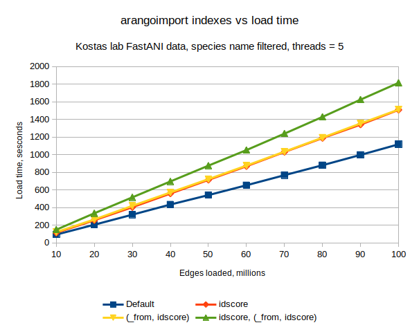
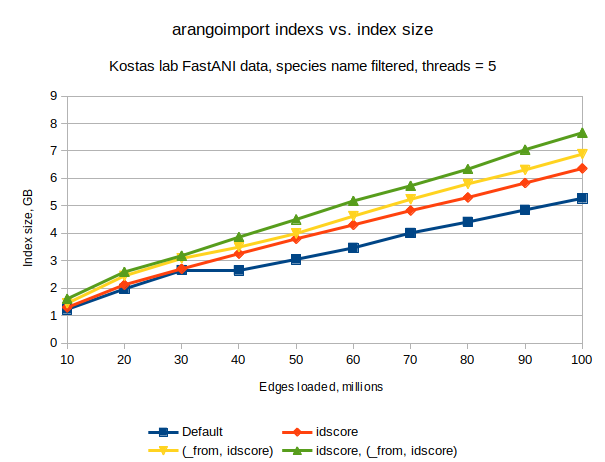

# Relation engine import benchmarking

## Testing FastANI relations between 90k genomes as edges

Data source: http://enve-omics.ce.gatech.edu/data/fastani

FastANI matrix, NCBI_Prok-matrix.txt.gz

~1B edges, ~90k verts

### Check key = fn(name1, name2) isn't too large for Arango

Max ArangoDB key length is [254 chars](https://github.com/arangodb/arangodb/issues/10754), so check max vert size:

```
$ ipython
Python 3.6.9 (default, Mar 15 2022, 13:55:28) 
Type 'copyright', 'credits' or 'license' for more information
IPython 7.4.0 -- An enhanced Interactive Python. Type '?' for help.

In [1]: maxlen = 0

In [2]: import gzip

# A few aborted attempts here

In [14]: matrix = gzip.open('NCBI_Prok-matrix.txt.gz', 'rt')

In [15]: for line in matrix: 
    ...:     name1, name2, percid = line.split(" ") 
    ...:     if len(name1) > maxlen: 
    ...:         print("1", name1, len(name1), maxlen) 
    ...:         maxlen = len(name1) 
    ...:     if len(name2) > maxlen:
    ...:         print("2", name2, len(name2), maxlen) 
    ...:         maxlen = len(name2) 
    ...:
1 Lactobacillus_plantarum_subsp__plantarum_ATCC_14917___JCM_1149___CGMCC_1_2437_GCA_000143745.LargeContigs.fna 108 105
1 Salmonella_enterica_subsp__enterica_serovar_Montevideo_str__USDA_ARS_USMARC_1903_NZ_CP007222.LargeContigs.fna 109 108
1 Salmonella_enterica_subsp__enterica_serovar_Typhimurium_str__LT2_4_delta_ramA__kan_GCA_000336195.LargeContigs.fna 113 109

In [16]:

```

So if we concatenate vert names to make edge keys it should be ok - 113 * 2 + 1 = 227

### Cluster config and client set up

Loading into a collection with shards = 3, replication factor = 1, standard indexes
(`_key` and `(_from, _to)`) on the CI cluster (3 nodes)

All experiments are run from a docker container on docker03.

### Import 100M GCA names in 10M batches recording time & disk space

[Test data setup](./create_test_data.md#100m-gca-id-edges-split-into-10m-chunks)

[Environment setup](./environment_setup.md#existing-docker-image)

Example run for threads = 1:
```
In [6]: files = !ls data/*GCAonly.head*-*.key.txt

In [8]: ret = run_imports(files, 1)
***data/NCBI_Prok-matrix.txt.gz.GCAonly.head0-10M.key.txt***
***data/NCBI_Prok-matrix.txt.gz.GCAonly.head10-20M.key.txt***
***data/NCBI_Prok-matrix.txt.gz.GCAonly.head20-30M.key.txt***
***data/NCBI_Prok-matrix.txt.gz.GCAonly.head30-40M.key.txt***
***data/NCBI_Prok-matrix.txt.gz.GCAonly.head40-50M.key.txt***
***data/NCBI_Prok-matrix.txt.gz.GCAonly.head50-60M.key.txt***
***data/NCBI_Prok-matrix.txt.gz.GCAonly.head60-70M.key.txt***
***data/NCBI_Prok-matrix.txt.gz.GCAonly.head70-80M.key.txt***
***data/NCBI_Prok-matrix.txt.gz.GCAonly.head80-90M.key.txt***
***data/NCBI_Prok-matrix.txt.gz.GCAonly.head90-100M.key.txt***

In [9]: ret
Out[9]: 
[{'time': 269.27555799484253, 'disk': 939411901, 'index': 1014359016},
 {'time': 260.0713520050049, 'disk': 1349245807, 'index': 1611683301},
 {'time': 262.94750022888184, 'disk': 1631814164, 'index': 2282676808},
 {'time': 263.59321808815, 'disk': 1834457317, 'index': 2832430175},
 {'time': 270.49464535713196, 'disk': 2301898073, 'index': 3287005881},
 {'time': 265.1101965904236, 'disk': 2715813051, 'index': 3667140778},
 {'time': 271.66647124290466, 'disk': 3083087581, 'index': 4052590502},
 {'time': 273.58852100372314, 'disk': 3442726185, 'index': 4623478467},
 {'time': 268.69639348983765, 'disk': 3761069220, 'index': 4958904221},
 {'time': 268.5925540924072, 'disk': 4175970449, 'index': 5417221812}]

In [12]: print_res(ret)
|Docs loaded (M)|Cumulative time (s)|Cumulative disk size (B)|Cumulative index size (B)|
|---|---|---|---|
|10|269.27555799484253|939411901|1014359016|
|20|529.3469099998474|1349245807|1611683301|
|30|792.2944102287292|1631814164|2282676808|
|40|1055.8876283168793|1834457317|2832430175|
|50|1326.3822736740112|2301898073|3287005881|
|60|1591.4924702644348|2715813051|3667140778|
|70|1863.1589415073395|3083087581|4052590502|
|80|2136.7474625110626|3442726185|4623478467|
|90|2405.4438560009003|3761069220|4958904221|
|100|2674.0364100933075|4175970449|5417221812|

```

#### Threads: 1
```
[{'time': 269.27555799484253, 'disk': 939411901, 'index': 1014359016},
 {'time': 260.0713520050049, 'disk': 1349245807, 'index': 1611683301},
 {'time': 262.94750022888184, 'disk': 1631814164, 'index': 2282676808},
 {'time': 263.59321808815, 'disk': 1834457317, 'index': 2832430175},
 {'time': 270.49464535713196, 'disk': 2301898073, 'index': 3287005881},
 {'time': 265.1101965904236, 'disk': 2715813051, 'index': 3667140778},
 {'time': 271.66647124290466, 'disk': 3083087581, 'index': 4052590502},
 {'time': 273.58852100372314, 'disk': 3442726185, 'index': 4623478467},
 {'time': 268.69639348983765, 'disk': 3761069220, 'index': 4958904221},
 {'time': 268.5925540924072, 'disk': 4175970449, 'index': 5417221812}]
```

|Docs loaded (M)|Cumulative time (s)|Cumulative disk size (B)|Cumulative index size (B)|
|---|---|---|---|
|10|269.27555799484253|939411901|1014359016|
|20|529.3469099998474|1349245807|1611683301|
|30|792.2944102287292|1631814164|2282676808|
|40|1055.8876283168793|1834457317|2832430175|
|50|1326.3822736740112|2301898073|3287005881|
|60|1591.4924702644348|2715813051|3667140778|
|70|1863.1589415073395|3083087581|4052590502|
|80|2136.7474625110626|3442726185|4623478467|
|90|2405.4438560009003|3761069220|4958904221|
|100|2674.0364100933075|4175970449|5417221812|

Time to load without chunking: 2654.2085466384888

#### Threads: 2

```
[{'time': 162.50271010398865, 'disk': 1089123555, 'index': 1547559666},
 {'time': 146.5888237953186, 'disk': 1310979922, 'index': 1822402821},
 {'time': 142.462890625, 'disk': 1722240686, 'index': 2374596699},
 {'time': 146.05258965492249, 'disk': 2032917869, 'index': 2908392605},
 {'time': 147.27964425086975, 'disk': 2424082853, 'index': 3432445955},
 {'time': 148.4281177520752, 'disk': 2762769794, 'index': 3817500475},
 {'time': 152.7095890045166, 'disk': 3125765439, 'index': 4126496961},
 {'time': 152.0172336101532, 'disk': 3487805249, 'index': 4586673462},
 {'time': 152.0630168914795, 'disk': 3870428919, 'index': 5165475988},
 {'time': 157.33430242538452, 'disk': 4145517491, 'index': 5381192671}]
```

|Docs loaded (M)|Cumulative time (s)|Cumulative disk size (B)|Cumulative index size (B)|
|---|---|---|---|
|10|162.50271010398865|1089123555|1547559666|
|20|309.09153389930725|1310979922|1822402821|
|30|451.55442452430725|1722240686|2374596699|
|40|597.6070141792297|2032917869|2908392605|
|50|744.8866584300995|2424082853|3432445955|
|60|893.3147761821747|2762769794|3817500475|
|70|1046.0243651866913|3125765439|4126496961|
|80|1198.0415987968445|3487805249|4586673462|
|90|1350.104615688324|3870428919|5165475988|
|100|1507.4389181137085|4145517491|5381192671|

Time to load without chunking: 1501.8327419757843

#### Threads: 5
```
[{'time': 82.61618256568909, 'disk': 1028416109, 'index': 1178578899},
 {'time': 93.2343819141388, 'disk': 1412548745, 'index': 1919106436},
 {'time': 100.10973262786865, 'disk': 1750961281, 'index': 2472092288},
 {'time': 103.07891869544983, 'disk': 2130080357, 'index': 3009628048},
 {'time': 105.06236481666565, 'disk': 2563519424, 'index': 3472262181},
 {'time': 109.6224672794342, 'disk': 2892115664, 'index': 3947697516},
 {'time': 115.8645966053009, 'disk': 3243101852, 'index': 4263697280},
 {'time': 114.3697292804718, 'disk': 3625831454, 'index': 4652460549},
 {'time': 110.75835919380188, 'disk': 4106390054, 'index': 5211345262},
 {'time': 115.44159722328186, 'disk': 4362265517, 'index': 5514485229}]
```

|Docs loaded (M)|Cumulative time (s)|Cumulative disk size (B)|Cumulative index size (B)|
|---|---|---|---|
|10|82.61618256568909|1028416109|1178578899|
|20|175.85056447982788|1412548745|1919106436|
|30|275.96029710769653|1750961281|2472092288|
|40|379.03921580314636|2130080357|3009628048|
|50|484.101580619812|2563519424|3472262181|
|60|593.7240478992462|2892115664|3947697516|
|70|709.5886445045471|3243101852|4263697280|
|80|823.9583737850189|3625831454|4652460549|
|90|934.7167329788208|4106390054|5211345262|
|100|1050.1583302021027|4362265517|5514485229|

Time to load without chunking: 1053.9380702972412

#### Threads: 10
```
[{'time': 87.05017137527466, 'disk': 2236442662, 'index': 1473379920},
 {'time': 93.59703421592712, 'disk': 2676066966, 'index': 2070743359},
 {'time': 99.17555260658264, 'disk': 1740117248, 'index': 2849776607},
 {'time': 99.67172241210938, 'disk': 2187804601, 'index': 3387705579},
 {'time': 103.1408953666687, 'disk': 2506598304, 'index': 3751101951},
 {'time': 104.7887213230133, 'disk': 3040381345, 'index': 4364063801},
 {'time': 103.23674011230469, 'disk': 3542169062, 'index': 4600724608},
 {'time': 104.69807362556458, 'disk': 3755623946, 'index': 4941651533},
 {'time': 105.69861245155334, 'disk': 4116761506, 'index': 5409674133},
 {'time': 108.95327091217041, 'disk': 4513367122, 'index': 5841878226}]

 ```

|Docs loaded (M)|Cumulative time (s)|Cumulative disk size (B)|Cumulative index size (B)|
|---|---|---|---|
|10|87.05017137527466|2236442662|1473379920|
|20|180.64720559120178|2676066966|2070743359|
|30|279.8227581977844|1740117248|2849776607|
|40|379.4944806098938|2187804601|3387705579|
|50|482.6353759765625|2506598304|3751101951|
|60|587.4240972995758|3040381345|4364063801|
|70|690.6608374118805|3542169062|4600724608|
|80|795.3589110374451|3755623946|4941651533|
|90|901.0575234889984|4116761506|5409674133|
|100|1010.0107944011688|4513367122|5841878226|

Time to load without chunking: 984.0401871204376

#### Threads: 20
```
[{'time': 83.00524592399597, 'disk': 1088634412, 'index': 2368193569},
 {'time': 102.83153247833252, 'disk': 1742261372, 'index': 2383289307},
 {'time': 118.12259697914124, 'disk': 2296869017, 'index': 2552836869},
 {'time': 98.42180371284485, 'disk': 2212252861, 'index': 3245254862},
 {'time': 100.04490566253662, 'disk': 2648500076, 'index': 3910376757},
 {'time': 101.33223032951355, 'disk': 3109872678, 'index': 4295152194},
 {'time': 105.38703346252441, 'disk': 3660888596, 'index': 4736229435},
 {'time': 103.67567420005798, 'disk': 3932108838, 'index': 5251204295},
 {'time': 100.8618516921997, 'disk': 4231695081, 'index': 5873872341},
 {'time': 104.34968733787537, 'disk': 4642203679, 'index': 6358290429}]
 ```

 |Docs loaded (M)|Cumulative time (s)|Cumulative disk size (B)|Cumulative index size (B)|
|---|---|---|---|
|10|83.00524592399597|1088634412|2368193569|
|20|185.8367784023285|1742261372|2383289307|
|30|303.9593753814697|2296869017|2552836869|
|40|402.3811790943146|2212252861|3245254862|
|50|502.4260847568512|2648500076|3910376757|
|60|603.7583150863647|3109872678|4295152194|
|70|709.1453485488892|3660888596|4736229435|
|80|812.8210227489471|3932108838|5251204295|
|90|913.6828744411469|4231695081|5873872341|
|100|1018.0325617790222|4642203679|6358290429|

Time to load without chunking: 983.1698892116547

#### Graphs






### Importing ~1B edges

[Test data setup](./create_test_data.md#790m-gca-edges)

[Environment setup](./environment_setup.md#existing-docker-image)

```
In [6]: files = ['data/NCBI_Prok-matrix.txt.gz.GCAonly.txt.gz']

In [7]: ret = run_imports(files, 5)
***data/NCBI_Prok-matrix.txt.gz.GCAonly.txt.gz***

In [8]: ret
Out[8]: [{'time': 9511.930794477463, 'disk': 30064289593, 'index': 34790415400}]
```

```
root@49a6ab15f017:/arangobenchmark/data# tail -5 NCBI_Prok-matrix.txt.gz.GCAonly.txt.gz.out 
created:          790182532
warnings/errors:  9227
updated/replaced: 0
ignored:          0
lines read:       790191760
```

Errors are all conflicts:
```
root@f94963f88a5a:/arangobenchmark/data# grep WARNING NCBI_Prok-matrix.txt.gz.GCAonly.txt.gz.out | grep -v "unique constraint"
root@f94963f88a5a:/arangobenchmark/data# 
```

### Import 10M edges into a collection with 780M edges

[Test data setup](./create_test_data.md#780m-cga-edges--10m-gca-edges)

[Environment setup](./environment_setup.md#existing-docker-image)

```
In [6]: files = ['data/NCBI_Prok-matrix.txt.gz.GCAonly.head780M.txt.gz', 'data/NCBI_Prok-matrix.txt.gz.GCAonly.head780-790M.txt']

In [7]: ret = run_imports(files, 5)
***data/NCBI_Prok-matrix.txt.gz.GCAonly.head780M.txt.gz***
***data/NCBI_Prok-matrix.txt.gz.GCAonly.head780-790M.txt***

In [8]: ret
Out[8]: 
[{'time': 9322.453085422516, 'disk': 29807987933, 'index': 34455606868},
 {'time': 126.4388222694397, 'disk': 30138533830, 'index': 34939498403}]
```

```
root@a85c5bf36a43:/arangobenchmark# tail -4 data/NCBI_Prok-matrix.txt.gz.GCAonly.head780M.txt.gz.out 
warnings/errors:  9116
updated/replaced: 0
ignored:          0
lines read:       780000001
root@a85c5bf36a43:/arangobenchmark# tail -4 data/NCBI_Prok-matrix.txt.gz.GCAonly.head780-790M.txt.out 
warnings/errors:  110
updated/replaced: 0
ignored:          0
lines read:       10000001
```

### Imports with full strain names

[Test data setup](./create_test_data.md#full-strain-names)

[Environment setup](./environment_setup.md#rebuild-docker-image)

```
In [6]: files = !ls data/NCBI_Prok-matrix.txt.key.gz

In [8]: ret = run_imports(files, 5)
***data/NCBI_Prok-matrix.txt.key.gz***

In [9]: ret
Out[9]: [{'time': 16552.933314561844, 'disk': 66566784024, 'index': 68504968850}]

root@903bb9f59479:/arangobenchmark# tail -5 data/NCBI_Prok-matrix.txt.key.gz.out 
created:          934312527
warnings/errors:  0
updated/replaced: 0
ignored:          0
lines read:       934312528
```

### Test with 2x replication, write concern = 1 or 2

[Test data setup](./create_test_data.md#100m-gca-id-edges-split-into-10m-chunks)

[Environment setup](./environment_setup.md#rebuild-docker-image-again-to-reduce-size)

Example run with replication = 1, write concern = 1
```
In [6]: files = !ls data/NCBI_Prok-matrix.txt.gz.GCAonly.head*-*M.key.txt.gz

In [8]: ret = run_imports(files, 5)
***data/NCBI_Prok-matrix.txt.gz.GCAonly.head0-10M.key.txt.gz***
***data/NCBI_Prok-matrix.txt.gz.GCAonly.head10-20M.key.txt.gz***
***data/NCBI_Prok-matrix.txt.gz.GCAonly.head20-30M.key.txt.gz***
***data/NCBI_Prok-matrix.txt.gz.GCAonly.head30-40M.key.txt.gz***
***data/NCBI_Prok-matrix.txt.gz.GCAonly.head40-50M.key.txt.gz***
***data/NCBI_Prok-matrix.txt.gz.GCAonly.head50-60M.key.txt.gz***
***data/NCBI_Prok-matrix.txt.gz.GCAonly.head60-70M.key.txt.gz***
***data/NCBI_Prok-matrix.txt.gz.GCAonly.head70-80M.key.txt.gz***
***data/NCBI_Prok-matrix.txt.gz.GCAonly.head80-90M.key.txt.gz***
***data/NCBI_Prok-matrix.txt.gz.GCAonly.head90-100M.key.txt.gz***

In [10]: ret
Out[10]: 
[{'time': 86.81573224067688, 'disk': 949347892, 'index': 1167781464},
 {'time': 101.16269755363464, 'disk': 1352009429, 'index': 1792281278},
 {'time': 106.16566228866577, 'disk': 1754879599, 'index': 2360931803},
 {'time': 109.93988513946533, 'disk': 2102285551, 'index': 2735284083},
 {'time': 113.78973937034607, 'disk': 2387373687, 'index': 3199688078},
 {'time': 114.59047746658325, 'disk': 2893977967, 'index': 3682897303},
 {'time': 113.77107119560242, 'disk': 3273406214, 'index': 4041828143},
 {'time': 123.94383144378662, 'disk': 3596679860, 'index': 4450177119},
 {'time': 116.43767976760864, 'disk': 3952700237, 'index': 4931605652},
 {'time': 122.76644206047058, 'disk': 4408017533, 'index': 5446271927}]

In [11]: print_res(ret)
|Docs loaded (M)|Cumulative time (s)|Cumulative disk size (B)|Cumulative index size (B)|
|---|---|---|---|
|10|86.81573224067688|949347892|1167781464|
|20|187.97842979431152|1352009429|1792281278|
|30|294.1440920829773|1754879599|2360931803|
|40|404.0839772224426|2102285551|2735284083|
|50|517.8737165927887|2387373687|3199688078|
|60|632.464194059372|2893977967|3682897303|
|70|746.2352652549744|3273406214|4041828143|
|80|870.179096698761|3596679860|4450177119|
|90|986.6167764663696|3952700237|4931605652|
|100|1109.3832185268402|4408017533|5446271927|
```

#### Replication 1, write concern = 1

```
In [10]: ret
Out[10]: 
[{'time': 86.81573224067688, 'disk': 949347892, 'index': 1167781464},
 {'time': 101.16269755363464, 'disk': 1352009429, 'index': 1792281278},
 {'time': 106.16566228866577, 'disk': 1754879599, 'index': 2360931803},
 {'time': 109.93988513946533, 'disk': 2102285551, 'index': 2735284083},
 {'time': 113.78973937034607, 'disk': 2387373687, 'index': 3199688078},
 {'time': 114.59047746658325, 'disk': 2893977967, 'index': 3682897303},
 {'time': 113.77107119560242, 'disk': 3273406214, 'index': 4041828143},
 {'time': 123.94383144378662, 'disk': 3596679860, 'index': 4450177119},
 {'time': 116.43767976760864, 'disk': 3952700237, 'index': 4931605652},
 {'time': 122.76644206047058, 'disk': 4408017533, 'index': 5446271927}]
 ```

|Docs loaded (M)|Cumulative time (s)|Cumulative disk size (B)|Cumulative index size (B)|
|---|---|---|---|
|10|86.81573224067688|949347892|1167781464|
|20|187.97842979431152|1352009429|1792281278|
|30|294.1440920829773|1754879599|2360931803|
|40|404.0839772224426|2102285551|2735284083|
|50|517.8737165927887|2387373687|3199688078|
|60|632.464194059372|2893977967|3682897303|
|70|746.2352652549744|3273406214|4041828143|
|80|870.179096698761|3596679860|4450177119|
|90|986.6167764663696|3952700237|4931605652|
|100|1109.3832185268402|4408017533|5446271927|

#### Replication 2, write concern = 1

```
In [9]: ret
Out[9]: 
[{'time': 187.63442873954773, 'disk': 827101724, 'index': 981185771},
 {'time': 215.33341908454895, 'disk': 1085746407, 'index': 1475026269},
 {'time': 218.79501628875732, 'disk': 1503111098, 'index': 2018335206},
 {'time': 222.90910935401917, 'disk': 1870773853, 'index': 2379575805},
 {'time': 228.29527640342712, 'disk': 2221447246, 'index': 2757545106},
 {'time': 233.11459732055664, 'disk': 2685796111, 'index': 3232485568},
 {'time': 233.15758442878723, 'disk': 3031608167, 'index': 3777998414},
 {'time': 235.30174851417542, 'disk': 3515258033, 'index': 4203683176},
 {'time': 240.15702867507935, 'disk': 3723252997, 'index': 4698533660},
 {'time': 231.10766696929932, 'disk': 4072413844, 'index': 5129758976}]
```

|Docs loaded (M)|Cumulative time (s)|Cumulative disk size (B)|Cumulative index size (B)|
|---|---|---|---|
|10|187.63442873954773|827101724|981185771|
|20|402.9678478240967|1085746407|1475026269|
|30|621.762864112854|1503111098|2018335206|
|40|844.6719734668732|1870773853|2379575805|
|50|1072.9672498703003|2221447246|2757545106|
|60|1306.081847190857|2685796111|3232485568|
|70|1539.2394316196442|3031608167|3777998414|
|80|1774.5411801338196|3515258033|4203683176|
|90|2014.698208808899|3723252997|4698533660|
|100|2245.8058757781982|4072413844|5129758976|

#### Replication 2, write concern = 1 run 2
Seems weird that the write concern doesn't affect the run time

```
[{'time': 188.29836058616638, 'disk': 644996268, 'index': 942502894},
 {'time': 217.9730761051178, 'disk': 988736888, 'index': 1390410832},
 {'time': 220.25408267974854, 'disk': 1390263951, 'index': 1821187303},
 {'time': 227.48054265975952, 'disk': 1734315395, 'index': 2187608952},
 {'time': 227.4465687274933, 'disk': 2118902105, 'index': 2585875079},
 {'time': 234.03539204597473, 'disk': 2527914818, 'index': 3162113656},
 {'time': 238.6825532913208, 'disk': 2836360297, 'index': 3610589263},
 {'time': 232.67825150489807, 'disk': 3219608093, 'index': 4143948055},
 {'time': 238.14066314697266, 'disk': 3626280333, 'index': 4616433525},
 {'time': 240.3454999923706, 'disk': 3888144478, 'index': 5052566303}]
```

|Docs loaded (M)|Cumulative time (s)|Cumulative disk size (B)|Cumulative index size (B)|
|---|---|---|---|
|10|188.29836058616638|644996268|942502894|
|20|406.2714366912842|988736888|1390410832|
|30|626.5255193710327|1390263951|1821187303|
|40|854.0060620307922|1734315395|2187608952|
|50|1081.4526307582855|2118902105|2585875079|
|60|1315.4880228042603|2527914818|3162113656|
|70|1554.170576095581|2836360297|3610589263|
|80|1786.8488276004791|3219608093|4143948055|
|90|2024.9894907474518|3626280333|4616433525|
|100|2265.3349907398224|3888144478|5052566303|


#### Replication 2, write concern = 2

```
In [14]: ret
Out[14]: 
[{'time': 202.84811568260193, 'disk': 791070725, 'index': 1036492066},
 {'time': 219.01715087890625, 'disk': 1050555342, 'index': 1312254228},
 {'time': 221.07375836372375, 'disk': 1511362413, 'index': 1864033328},
 {'time': 226.06171917915344, 'disk': 1847668738, 'index': 2317275687},
 {'time': 232.40011930465698, 'disk': 2159771737, 'index': 2693763483},
 {'time': 232.5830192565918, 'disk': 2517824849, 'index': 3224745190},
 {'time': 225.28864288330078, 'disk': 2898331481, 'index': 3717340008},
 {'time': 231.02699995040894, 'disk': 3203535008, 'index': 4083733890},
 {'time': 233.80236911773682, 'disk': 3686826765, 'index': 4567129658},
 {'time': 232.3505344390869, 'disk': 3909801576, 'index': 4994828412}]
```

|Docs loaded (M)|Cumulative time (s)|Cumulative disk size (B)|Cumulative index size (B)|
|---|---|---|---|
|10|202.84811568260193|791070725|1036492066|
|20|421.8652665615082|1050555342|1312254228|
|30|642.9390249252319|1511362413|1864033328|
|40|869.0007441043854|1847668738|2317275687|
|50|1101.4008634090424|2159771737|2693763483|
|60|1333.9838826656342|2517824849|3224745190|
|70|1559.272525548935|2898331481|3717340008|
|80|1790.2995254993439|3203535008|4083733890|
|90|2024.1018946170807|3686826765|4567129658|
|100|2256.4524290561676|3909801576|4994828412|

#### Graphs




Note: I assume that the API is only reporting the non-replicated data size.



### Test with non-default indexes

[Test data setup](./create_test_data.md#100m-gca-id-edges-split-into-10m-chunks)

[Environment setup](./environment_setup.md#rebuild-docker-image-again-to-reduce-size)

#### Default indexes only

```
In [23]: ret
Out[23]: 
[{'time': 93.91339468955994, 'disk': 1235229298, 'index': 1228322453},
 {'time': 112.07426142692566, 'disk': 1956661901, 'index': 1971769790},
 {'time': 114.02546834945679, 'disk': 2397984943, 'index': 2657861644},
 {'time': 115.20665979385376, 'disk': 2099215270, 'index': 2645503026},
 {'time': 106.984530210495, 'disk': 2540663598, 'index': 3049459833},
 {'time': 111.6163682937622, 'disk': 2905725090, 'index': 3468584774},
 {'time': 114.51443886756897, 'disk': 3192458908, 'index': 4011027908},
 {'time': 112.93931531906128, 'disk': 3670471828, 'index': 4413228560},
 {'time': 117.57841348648071, 'disk': 4025262850, 'index': 4852627837},
 {'time': 120.16149091720581, 'disk': 4379503455, 'index': 5275170224}]
```

|Docs loaded (M)|Cumulative time (s)|Cumulative disk size (B)|Cumulative index size (B)|
|---|---|---|---|
|10|93.91339468955994|1235229298|1228322453|
|20|205.9876561164856|1956661901|1971769790|
|30|320.0131244659424|2397984943|2657861644|
|40|435.21978425979614|2099215270|2645503026|
|50|542.2043144702911|2540663598|3049459833|
|60|653.8206827640533|2905725090|3468584774|
|70|768.3351216316223|3192458908|4011027908|
|80|881.2744369506836|3670471828|4413228560|
|90|998.8528504371643|4025262850|4852627837|
|100|1119.0143413543701|4379503455|5275170224|

#### Index on `idscore`

```
In [26]: ret
Out[26]: 
[{'time': 114.69688940048218, 'disk': 948588257, 'index': 1297099278},
 {'time': 142.20149397850037, 'disk': 1292590808, 'index': 2123643737},
 {'time': 147.73057413101196, 'disk': 1739289979, 'index': 2702233839},
 {'time': 154.80180644989014, 'disk': 2159203583, 'index': 3256186475},
 {'time': 155.04610085487366, 'disk': 2502147632, 'index': 3797944619},
 {'time': 154.92384481430054, 'disk': 2804829055, 'index': 4306955124},
 {'time': 162.36743640899658, 'disk': 3201657437, 'index': 4826381000},
 {'time': 157.81246519088745, 'disk': 3598833418, 'index': 5305114581},
 {'time': 152.89931464195251, 'disk': 3957695823, 'index': 5831571704},
 {'time': 167.672301530838, 'disk': 4364973930, 'index': 6362445690}]
```

|Docs loaded (M)|Cumulative time (s)|Cumulative disk size (B)|Cumulative index size (B)|
|---|---|---|---|
|10|114.69688940048218|948588257|1297099278|
|20|256.89838337898254|1292590808|2123643737|
|30|404.6289575099945|1739289979|2702233839|
|40|559.4307639598846|2159203583|3256186475|
|50|714.4768648147583|2502147632|3797944619|
|60|869.4007096290588|2804829055|4306955124|
|70|1031.7681460380554|3201657437|4826381000|
|80|1189.5806112289429|3598833418|5305114581|
|90|1342.4799258708954|3957695823|5831571704|
|100|1510.1522274017334|4364973930|6362445690|

#### Compound index on `(_from, idscore)`

```
In [29]: ret
Out[29]: 
[{'time': 122.32378935813904, 'disk': 945334060, 'index': 1448453626},
 {'time': 143.35665678977966, 'disk': 1332652567, 'index': 2449645339},
 {'time': 154.5305860042572, 'disk': 1753552658, 'index': 3083071553},
 {'time': 151.94220447540283, 'disk': 2075101495, 'index': 3494372508},
 {'time': 150.93012523651123, 'disk': 2429523351, 'index': 3990112480},
 {'time': 154.10640120506287, 'disk': 2934113142, 'index': 4626620108},
 {'time': 158.56742596626282, 'disk': 3242089454, 'index': 5236666873},
 {'time': 159.0283432006836, 'disk': 3639668650, 'index': 5800190672},
 {'time': 160.7344651222229, 'disk': 4016841202, 'index': 6309047402},
 {'time': 157.94693422317505, 'disk': 4324229459, 'index': 6885085090}]
```

|Docs loaded (M)|Cumulative time (s)|Cumulative disk size (B)|Cumulative index size (B)|
|---|---|---|---|
|10|122.32378935813904|945334060|1448453626|
|20|265.6804461479187|1332652567|2449645339|
|30|420.2110321521759|1753552658|3083071553|
|40|572.1532366275787|2075101495|3494372508|
|50|723.08336186409|2429523351|3990112480|
|60|877.1897630691528|2934113142|4626620108|
|70|1035.7571890354156|3242089454|5236666873|
|80|1194.7855322360992|3639668650|5800190672|
|90|1355.5199973583221|4016841202|6309047402|
|100|1513.4669315814972|4324229459|6885085090|

#### Index on `idscore` and compound index on `(_from, idscore)`

```
In [32]: ret
Out[32]: 
[{'time': 149.36351442337036, 'disk': 943879047, 'index': 1611580555},
 {'time': 186.69845533370972, 'disk': 1342603225, 'index': 2589794062},
 {'time': 180.91013312339783, 'disk': 1776615031, 'index': 3182076792},
 {'time': 180.05889749526978, 'disk': 2117294480, 'index': 3859472901},
 {'time': 179.43872237205505, 'disk': 2453699855, 'index': 4505192090},
 {'time': 176.96496033668518, 'disk': 2795053584, 'index': 5177869834},
 {'time': 187.02225518226624, 'disk': 3194074647, 'index': 5730535961},
 {'time': 189.66774368286133, 'disk': 3617346033, 'index': 6336243646},
 {'time': 196.10493922233582, 'disk': 3938484523, 'index': 7046135851},
 {'time': 191.00657558441162, 'disk': 4399651482, 'index': 7662490568}]
```

|Docs loaded (M)|Cumulative time (s)|Cumulative disk size (B)|Cumulative index size (B)|
|---|---|---|---|
|10|149.36351442337036|943879047|1611580555|
|20|336.0619697570801|1342603225|2589794062|
|30|516.9721028804779|1776615031|3182076792|
|40|697.0310003757477|2117294480|3859472901|
|50|876.4697227478027|2453699855|4505192090|
|60|1053.434683084488|2795053584|5177869834|
|70|1240.4569382667542|3194074647|5730535961|
|80|1430.1246819496155|3617346033|6336243646|
|90|1626.2296211719513|3938484523|7046135851|
|100|1817.236196756363|4399651482|7662490568|

#### Graphs



