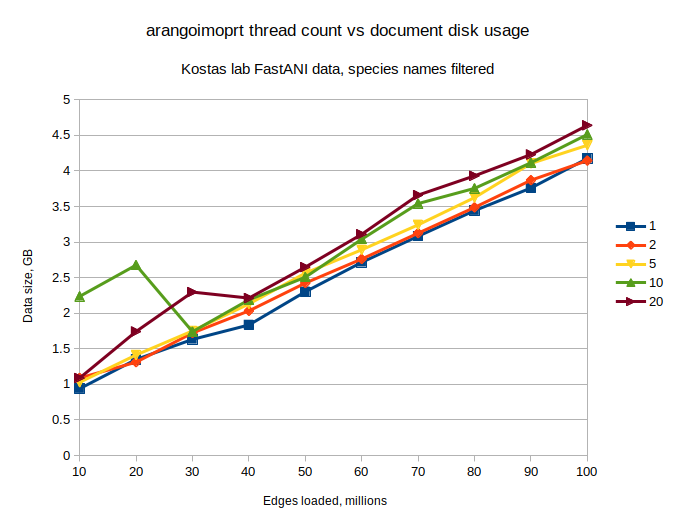
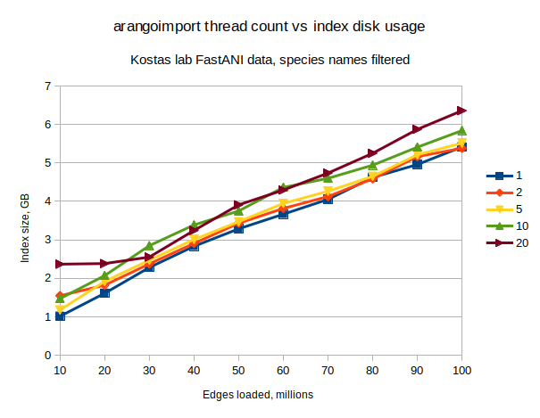

# Import 100M GCA names in 10M batches recording time & disk space

[Test data setup](../create_test_data.md#100m-gca-id-edges-split-into-10m-chunks)

[Environment setup](../environment_setup.md#existing-docker-image)

Example run for threads = 1:
```
In [6]: files = !ls data/*GCAonly.head*-*.key.txt

In [8]: ret = run_imports(files, 1)
***data/NCBI_Prok-matrix.txt.gz.GCAonly.head0-10M.key.txt***
***data/NCBI_Prok-matrix.txt.gz.GCAonly.head10-20M.key.txt***
***data/NCBI_Prok-matrix.txt.gz.GCAonly.head20-30M.key.txt***
***data/NCBI_Prok-matrix.txt.gz.GCAonly.head30-40M.key.txt***
***data/NCBI_Prok-matrix.txt.gz.GCAonly.head40-50M.key.txt***
***data/NCBI_Prok-matrix.txt.gz.GCAonly.head50-60M.key.txt***
***data/NCBI_Prok-matrix.txt.gz.GCAonly.head60-70M.key.txt***
***data/NCBI_Prok-matrix.txt.gz.GCAonly.head70-80M.key.txt***
***data/NCBI_Prok-matrix.txt.gz.GCAonly.head80-90M.key.txt***
***data/NCBI_Prok-matrix.txt.gz.GCAonly.head90-100M.key.txt***

In [9]: ret
Out[9]: 
[{'time': 269.27555799484253, 'disk': 939411901, 'index': 1014359016},
 {'time': 260.0713520050049, 'disk': 1349245807, 'index': 1611683301},
 {'time': 262.94750022888184, 'disk': 1631814164, 'index': 2282676808},
 {'time': 263.59321808815, 'disk': 1834457317, 'index': 2832430175},
 {'time': 270.49464535713196, 'disk': 2301898073, 'index': 3287005881},
 {'time': 265.1101965904236, 'disk': 2715813051, 'index': 3667140778},
 {'time': 271.66647124290466, 'disk': 3083087581, 'index': 4052590502},
 {'time': 273.58852100372314, 'disk': 3442726185, 'index': 4623478467},
 {'time': 268.69639348983765, 'disk': 3761069220, 'index': 4958904221},
 {'time': 268.5925540924072, 'disk': 4175970449, 'index': 5417221812}]

In [12]: print_res(ret)
|Docs loaded (M)|Cumulative time (s)|Cumulative disk size (B)|Cumulative index size (B)|
|---|---|---|---|
|10|269.27555799484253|939411901|1014359016|
|20|529.3469099998474|1349245807|1611683301|
|30|792.2944102287292|1631814164|2282676808|
|40|1055.8876283168793|1834457317|2832430175|
|50|1326.3822736740112|2301898073|3287005881|
|60|1591.4924702644348|2715813051|3667140778|
|70|1863.1589415073395|3083087581|4052590502|
|80|2136.7474625110626|3442726185|4623478467|
|90|2405.4438560009003|3761069220|4958904221|
|100|2674.0364100933075|4175970449|5417221812|

```

## Threads: 1
```
[{'time': 269.27555799484253, 'disk': 939411901, 'index': 1014359016},
 {'time': 260.0713520050049, 'disk': 1349245807, 'index': 1611683301},
 {'time': 262.94750022888184, 'disk': 1631814164, 'index': 2282676808},
 {'time': 263.59321808815, 'disk': 1834457317, 'index': 2832430175},
 {'time': 270.49464535713196, 'disk': 2301898073, 'index': 3287005881},
 {'time': 265.1101965904236, 'disk': 2715813051, 'index': 3667140778},
 {'time': 271.66647124290466, 'disk': 3083087581, 'index': 4052590502},
 {'time': 273.58852100372314, 'disk': 3442726185, 'index': 4623478467},
 {'time': 268.69639348983765, 'disk': 3761069220, 'index': 4958904221},
 {'time': 268.5925540924072, 'disk': 4175970449, 'index': 5417221812}]
```

|Docs loaded (M)|Cumulative time (s)|Cumulative disk size (B)|Cumulative index size (B)|
|---|---|---|---|
|10|269.27555799484253|939411901|1014359016|
|20|529.3469099998474|1349245807|1611683301|
|30|792.2944102287292|1631814164|2282676808|
|40|1055.8876283168793|1834457317|2832430175|
|50|1326.3822736740112|2301898073|3287005881|
|60|1591.4924702644348|2715813051|3667140778|
|70|1863.1589415073395|3083087581|4052590502|
|80|2136.7474625110626|3442726185|4623478467|
|90|2405.4438560009003|3761069220|4958904221|
|100|2674.0364100933075|4175970449|5417221812|

Time to load without chunking: 2654.2085466384888

## Threads: 2

```
[{'time': 162.50271010398865, 'disk': 1089123555, 'index': 1547559666},
 {'time': 146.5888237953186, 'disk': 1310979922, 'index': 1822402821},
 {'time': 142.462890625, 'disk': 1722240686, 'index': 2374596699},
 {'time': 146.05258965492249, 'disk': 2032917869, 'index': 2908392605},
 {'time': 147.27964425086975, 'disk': 2424082853, 'index': 3432445955},
 {'time': 148.4281177520752, 'disk': 2762769794, 'index': 3817500475},
 {'time': 152.7095890045166, 'disk': 3125765439, 'index': 4126496961},
 {'time': 152.0172336101532, 'disk': 3487805249, 'index': 4586673462},
 {'time': 152.0630168914795, 'disk': 3870428919, 'index': 5165475988},
 {'time': 157.33430242538452, 'disk': 4145517491, 'index': 5381192671}]
```

|Docs loaded (M)|Cumulative time (s)|Cumulative disk size (B)|Cumulative index size (B)|
|---|---|---|---|
|10|162.50271010398865|1089123555|1547559666|
|20|309.09153389930725|1310979922|1822402821|
|30|451.55442452430725|1722240686|2374596699|
|40|597.6070141792297|2032917869|2908392605|
|50|744.8866584300995|2424082853|3432445955|
|60|893.3147761821747|2762769794|3817500475|
|70|1046.0243651866913|3125765439|4126496961|
|80|1198.0415987968445|3487805249|4586673462|
|90|1350.104615688324|3870428919|5165475988|
|100|1507.4389181137085|4145517491|5381192671|

Time to load without chunking: 1501.8327419757843

## Threads: 5
```
[{'time': 82.61618256568909, 'disk': 1028416109, 'index': 1178578899},
 {'time': 93.2343819141388, 'disk': 1412548745, 'index': 1919106436},
 {'time': 100.10973262786865, 'disk': 1750961281, 'index': 2472092288},
 {'time': 103.07891869544983, 'disk': 2130080357, 'index': 3009628048},
 {'time': 105.06236481666565, 'disk': 2563519424, 'index': 3472262181},
 {'time': 109.6224672794342, 'disk': 2892115664, 'index': 3947697516},
 {'time': 115.8645966053009, 'disk': 3243101852, 'index': 4263697280},
 {'time': 114.3697292804718, 'disk': 3625831454, 'index': 4652460549},
 {'time': 110.75835919380188, 'disk': 4106390054, 'index': 5211345262},
 {'time': 115.44159722328186, 'disk': 4362265517, 'index': 5514485229}]
```

|Docs loaded (M)|Cumulative time (s)|Cumulative disk size (B)|Cumulative index size (B)|
|---|---|---|---|
|10|82.61618256568909|1028416109|1178578899|
|20|175.85056447982788|1412548745|1919106436|
|30|275.96029710769653|1750961281|2472092288|
|40|379.03921580314636|2130080357|3009628048|
|50|484.101580619812|2563519424|3472262181|
|60|593.7240478992462|2892115664|3947697516|
|70|709.5886445045471|3243101852|4263697280|
|80|823.9583737850189|3625831454|4652460549|
|90|934.7167329788208|4106390054|5211345262|
|100|1050.1583302021027|4362265517|5514485229|

Time to load without chunking: 1053.9380702972412

## Threads: 10
```
[{'time': 87.05017137527466, 'disk': 2236442662, 'index': 1473379920},
 {'time': 93.59703421592712, 'disk': 2676066966, 'index': 2070743359},
 {'time': 99.17555260658264, 'disk': 1740117248, 'index': 2849776607},
 {'time': 99.67172241210938, 'disk': 2187804601, 'index': 3387705579},
 {'time': 103.1408953666687, 'disk': 2506598304, 'index': 3751101951},
 {'time': 104.7887213230133, 'disk': 3040381345, 'index': 4364063801},
 {'time': 103.23674011230469, 'disk': 3542169062, 'index': 4600724608},
 {'time': 104.69807362556458, 'disk': 3755623946, 'index': 4941651533},
 {'time': 105.69861245155334, 'disk': 4116761506, 'index': 5409674133},
 {'time': 108.95327091217041, 'disk': 4513367122, 'index': 5841878226}]

 ```

|Docs loaded (M)|Cumulative time (s)|Cumulative disk size (B)|Cumulative index size (B)|
|---|---|---|---|
|10|87.05017137527466|2236442662|1473379920|
|20|180.64720559120178|2676066966|2070743359|
|30|279.8227581977844|1740117248|2849776607|
|40|379.4944806098938|2187804601|3387705579|
|50|482.6353759765625|2506598304|3751101951|
|60|587.4240972995758|3040381345|4364063801|
|70|690.6608374118805|3542169062|4600724608|
|80|795.3589110374451|3755623946|4941651533|
|90|901.0575234889984|4116761506|5409674133|
|100|1010.0107944011688|4513367122|5841878226|

Time to load without chunking: 984.0401871204376

## Threads: 20
```
[{'time': 83.00524592399597, 'disk': 1088634412, 'index': 2368193569},
 {'time': 102.83153247833252, 'disk': 1742261372, 'index': 2383289307},
 {'time': 118.12259697914124, 'disk': 2296869017, 'index': 2552836869},
 {'time': 98.42180371284485, 'disk': 2212252861, 'index': 3245254862},
 {'time': 100.04490566253662, 'disk': 2648500076, 'index': 3910376757},
 {'time': 101.33223032951355, 'disk': 3109872678, 'index': 4295152194},
 {'time': 105.38703346252441, 'disk': 3660888596, 'index': 4736229435},
 {'time': 103.67567420005798, 'disk': 3932108838, 'index': 5251204295},
 {'time': 100.8618516921997, 'disk': 4231695081, 'index': 5873872341},
 {'time': 104.34968733787537, 'disk': 4642203679, 'index': 6358290429}]
 ```

 |Docs loaded (M)|Cumulative time (s)|Cumulative disk size (B)|Cumulative index size (B)|
|---|---|---|---|
|10|83.00524592399597|1088634412|2368193569|
|20|185.8367784023285|1742261372|2383289307|
|30|303.9593753814697|2296869017|2552836869|
|40|402.3811790943146|2212252861|3245254862|
|50|502.4260847568512|2648500076|3910376757|
|60|603.7583150863647|3109872678|4295152194|
|70|709.1453485488892|3660888596|4736229435|
|80|812.8210227489471|3932108838|5251204295|
|90|913.6828744411469|4231695081|5873872341|
|100|1018.0325617790222|4642203679|6358290429|

Time to load without chunking: 983.1698892116547

## Graphs



