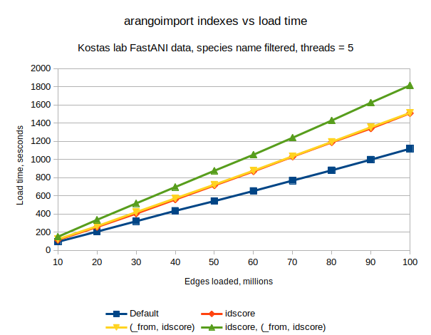
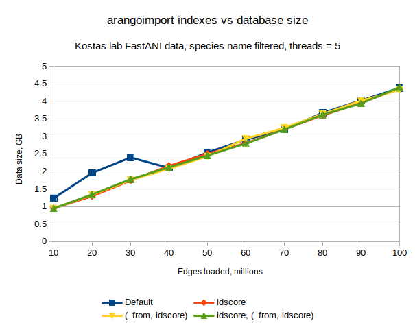

# Test with non-default indexes

[Test data setup](../create_test_data.md#100m-gca-id-edges-split-into-10m-chunks)

[Environment setup](../environment_setup.md#rebuild-docker-image-again-to-reduce-size)

## Default indexes only

```
In [23]: ret
Out[23]: 
[{'time': 93.91339468955994, 'disk': 1235229298, 'index': 1228322453},
 {'time': 112.07426142692566, 'disk': 1956661901, 'index': 1971769790},
 {'time': 114.02546834945679, 'disk': 2397984943, 'index': 2657861644},
 {'time': 115.20665979385376, 'disk': 2099215270, 'index': 2645503026},
 {'time': 106.984530210495, 'disk': 2540663598, 'index': 3049459833},
 {'time': 111.6163682937622, 'disk': 2905725090, 'index': 3468584774},
 {'time': 114.51443886756897, 'disk': 3192458908, 'index': 4011027908},
 {'time': 112.93931531906128, 'disk': 3670471828, 'index': 4413228560},
 {'time': 117.57841348648071, 'disk': 4025262850, 'index': 4852627837},
 {'time': 120.16149091720581, 'disk': 4379503455, 'index': 5275170224}]
```

|Docs loaded (M)|Cumulative time (s)|Cumulative disk size (B)|Cumulative index size (B)|
|---|---|---|---|
|10|93.91339468955994|1235229298|1228322453|
|20|205.9876561164856|1956661901|1971769790|
|30|320.0131244659424|2397984943|2657861644|
|40|435.21978425979614|2099215270|2645503026|
|50|542.2043144702911|2540663598|3049459833|
|60|653.8206827640533|2905725090|3468584774|
|70|768.3351216316223|3192458908|4011027908|
|80|881.2744369506836|3670471828|4413228560|
|90|998.8528504371643|4025262850|4852627837|
|100|1119.0143413543701|4379503455|5275170224|

## Index on `idscore`

```
In [26]: ret
Out[26]: 
[{'time': 114.69688940048218, 'disk': 948588257, 'index': 1297099278},
 {'time': 142.20149397850037, 'disk': 1292590808, 'index': 2123643737},
 {'time': 147.73057413101196, 'disk': 1739289979, 'index': 2702233839},
 {'time': 154.80180644989014, 'disk': 2159203583, 'index': 3256186475},
 {'time': 155.04610085487366, 'disk': 2502147632, 'index': 3797944619},
 {'time': 154.92384481430054, 'disk': 2804829055, 'index': 4306955124},
 {'time': 162.36743640899658, 'disk': 3201657437, 'index': 4826381000},
 {'time': 157.81246519088745, 'disk': 3598833418, 'index': 5305114581},
 {'time': 152.89931464195251, 'disk': 3957695823, 'index': 5831571704},
 {'time': 167.672301530838, 'disk': 4364973930, 'index': 6362445690}]
```

|Docs loaded (M)|Cumulative time (s)|Cumulative disk size (B)|Cumulative index size (B)|
|---|---|---|---|
|10|114.69688940048218|948588257|1297099278|
|20|256.89838337898254|1292590808|2123643737|
|30|404.6289575099945|1739289979|2702233839|
|40|559.4307639598846|2159203583|3256186475|
|50|714.4768648147583|2502147632|3797944619|
|60|869.4007096290588|2804829055|4306955124|
|70|1031.7681460380554|3201657437|4826381000|
|80|1189.5806112289429|3598833418|5305114581|
|90|1342.4799258708954|3957695823|5831571704|
|100|1510.1522274017334|4364973930|6362445690|

## Compound index on `(_from, idscore)`

```
In [29]: ret
Out[29]: 
[{'time': 122.32378935813904, 'disk': 945334060, 'index': 1448453626},
 {'time': 143.35665678977966, 'disk': 1332652567, 'index': 2449645339},
 {'time': 154.5305860042572, 'disk': 1753552658, 'index': 3083071553},
 {'time': 151.94220447540283, 'disk': 2075101495, 'index': 3494372508},
 {'time': 150.93012523651123, 'disk': 2429523351, 'index': 3990112480},
 {'time': 154.10640120506287, 'disk': 2934113142, 'index': 4626620108},
 {'time': 158.56742596626282, 'disk': 3242089454, 'index': 5236666873},
 {'time': 159.0283432006836, 'disk': 3639668650, 'index': 5800190672},
 {'time': 160.7344651222229, 'disk': 4016841202, 'index': 6309047402},
 {'time': 157.94693422317505, 'disk': 4324229459, 'index': 6885085090}]
```

|Docs loaded (M)|Cumulative time (s)|Cumulative disk size (B)|Cumulative index size (B)|
|---|---|---|---|
|10|122.32378935813904|945334060|1448453626|
|20|265.6804461479187|1332652567|2449645339|
|30|420.2110321521759|1753552658|3083071553|
|40|572.1532366275787|2075101495|3494372508|
|50|723.08336186409|2429523351|3990112480|
|60|877.1897630691528|2934113142|4626620108|
|70|1035.7571890354156|3242089454|5236666873|
|80|1194.7855322360992|3639668650|5800190672|
|90|1355.5199973583221|4016841202|6309047402|
|100|1513.4669315814972|4324229459|6885085090|

## Index on `idscore` and compound index on `(_from, idscore)`

```
In [32]: ret
Out[32]: 
[{'time': 149.36351442337036, 'disk': 943879047, 'index': 1611580555},
 {'time': 186.69845533370972, 'disk': 1342603225, 'index': 2589794062},
 {'time': 180.91013312339783, 'disk': 1776615031, 'index': 3182076792},
 {'time': 180.05889749526978, 'disk': 2117294480, 'index': 3859472901},
 {'time': 179.43872237205505, 'disk': 2453699855, 'index': 4505192090},
 {'time': 176.96496033668518, 'disk': 2795053584, 'index': 5177869834},
 {'time': 187.02225518226624, 'disk': 3194074647, 'index': 5730535961},
 {'time': 189.66774368286133, 'disk': 3617346033, 'index': 6336243646},
 {'time': 196.10493922233582, 'disk': 3938484523, 'index': 7046135851},
 {'time': 191.00657558441162, 'disk': 4399651482, 'index': 7662490568}]
```

|Docs loaded (M)|Cumulative time (s)|Cumulative disk size (B)|Cumulative index size (B)|
|---|---|---|---|
|10|149.36351442337036|943879047|1611580555|
|20|336.0619697570801|1342603225|2589794062|
|30|516.9721028804779|1776615031|3182076792|
|40|697.0310003757477|2117294480|3859472901|
|50|876.4697227478027|2453699855|4505192090|
|60|1053.434683084488|2795053584|5177869834|
|70|1240.4569382667542|3194074647|5730535961|
|80|1430.1246819496155|3617346033|6336243646|
|90|1626.2296211719513|3938484523|7046135851|
|100|1817.236196756363|4399651482|7662490568|

## Graphs



