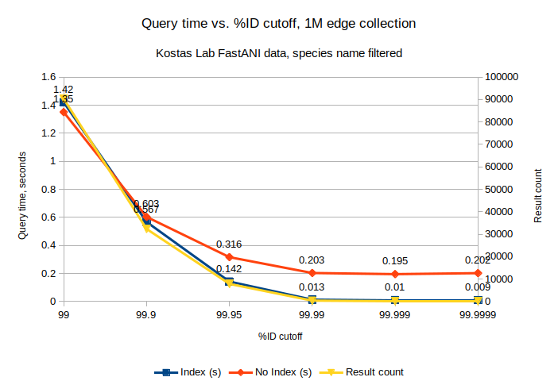
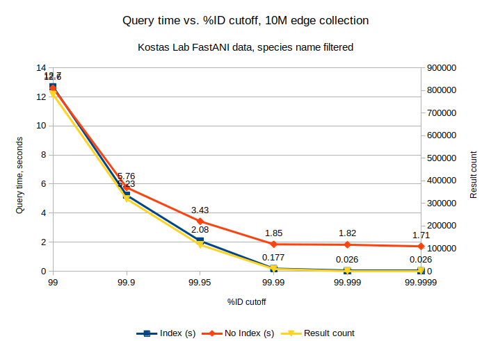
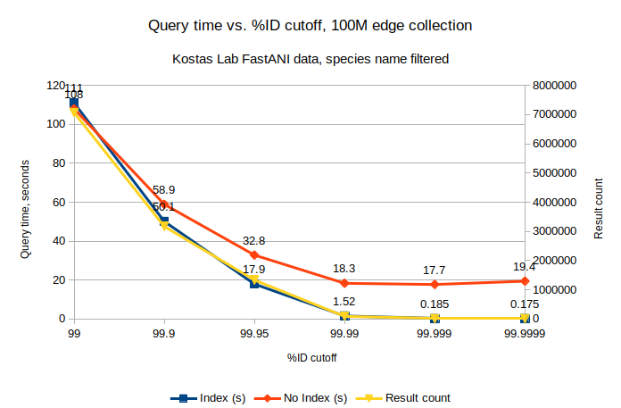
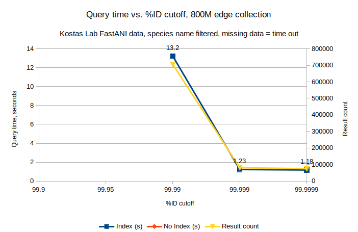
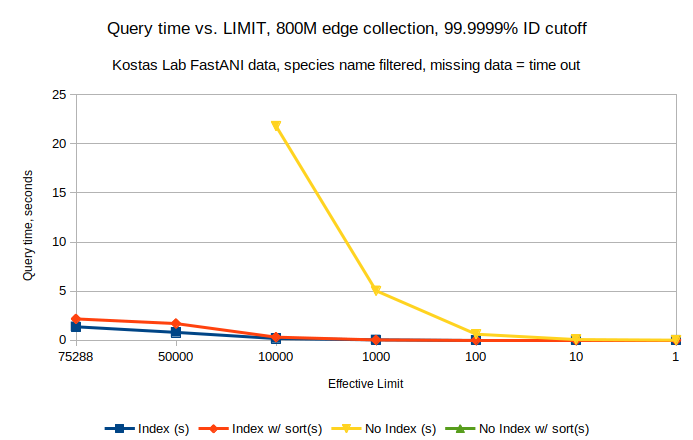
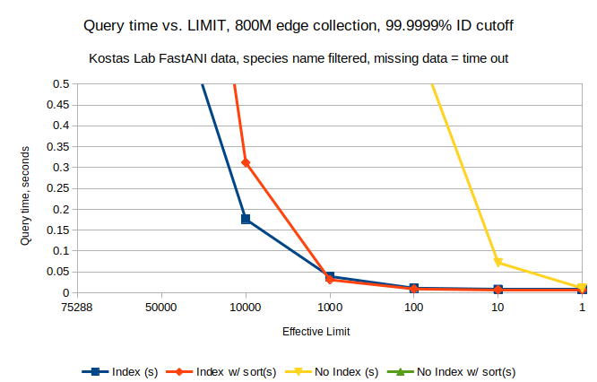

# Test query timing for ID score cutoff with different collection sizes

[Test data setup for 10M and 100M GCA names](../create_test_data.md#100m-gca-id-edges-split-into-10m-chunks)  
[Test data setup for 800M GCA names](../create_test_data.md#780m-cga-edges--10m-gca-edges)

[Starting environment](https://github.com/MrCreosote/relation_engine_import_benchmarking/blob/main/environment_setup.md#rebuild-docker-image-again-to-reduce-size)

## Additional data set up

```
root@02979850a9e3:/arangobenchmark# gunzip -c data/NCBI_Prok-matrix.txt.gz.GCAonly.txt.gz | head -1000000 | gzip > data/NCBI_Prok-matrix.txt.gz.GCAonly.head0-1M.key.txt.gz
root@02979850a9e3:/arangobenchmark/data# gunzip -c NCBI_Prok-matrix.txt.gz.GCAonly.head0-1M.key.txt.gz | wc -l
1000000
```

`head` and `tail` look good

## Test that the data is unsorted

The plan is to randomly choose 1000 or so IDs from the first 1M lines of the data and then
run queries against 1M, 10M, 100M, and 800M item Arango collections. If the data is ordered,
then the first 1M lines of the data will be first in the index and so that might have an effect
on the search time. If the data is unordered then it shouldn't.

```
root@28c427a095af:/arangobenchmark/data# ipython
Python 3.10.4 (main, May 28 2022, 13:14:58) [GCC 10.2.1 20210110]
Type 'copyright', 'credits' or 'license' for more information
IPython 8.4.0 -- An enhanced Interactive Python. Type '?' for help.

In [1]: import gzip

In [3]: from_ = []

In [5]: with gzip.open('NCBI_Prok-matrix.txt.gz.GCAonly.txt.gz', 'rt') as infile
   ...: :
   ...:     for l in infile:
   ...:         f, t, s, k = l.split(',')
   ...:         from_.append(f)
   ...: 

In [6]: import random

In [7]: 
   ...: def stochastic_sortedness(list_, num_samples):
   ...:     ''' Based on https://stackoverflow.com/a/16994740/643675 '''
   ...:     if len(list_) < 2:
   ...:         return 0
   ...:     # a 2 item list works, but is a pretty dumb thing to pass to this fu
   ...: nction *shrug*
   ...:     maxindex = len(list_) - 1
   ...:     score = 0
   ...:     count = 0
   ...:     while count < num_samples:
   ...:         i1 = random.randint(0, maxindex)
   ...:         i2 = random.randint(0, maxindex)
   ...:         if i1 != i2:
   ...:             score += 0 if list_[min(i1, i2)] <= list_[max(i1, i2)] else
   ...: 1
   ...:             count += 1
   ...:     return score / num_samples
   ...: 

In [8]: len(from_)
Out[8]: 790191759

In [10]: stochastic_sortedness(from_, 100000)
Out[10]: 0.49895

In [11]: stochastic_sortedness(from_[0:100000000], 100000)
Out[11]: 0.50089

In [12]: stochastic_sortedness(from_[0:10000000], 100000)
Out[12]: 0.49483

In [13]: stochastic_sortedness(from_[0:1000000], 100000)
Out[13]: 0.4892
```

## Additional environment set up

Shell script:
```
root@02979850a9e3:/arangobenchmark# cat import.parameterized.collection.sh 
#!/usr/bin/env sh

arango/3.9.1/bin/arangoimport \
    --file $INFILE \
    --headers-file data/NCBI_Prok-matrix.txt.key.headers.txt \
    --type csv \
    --separator "," \
    --progress true \
    --server.endpoint tcp://10.58.1.211:8531 \
    --server.username gavin \
    --server.password $ARANGO_PWD_CI \
    --server.database gavin_test \
    --collection $COLLECTION \
    --log.foreground-tty true \
    --from-collection-prefix node \
    --to-collection-prefix node \
    --threads $THREADS
```

ipython (just loading data here, so no timing analysis):
```
root@02979850a9e3:/arangobenchmark# ipython
Python 3.10.4 (main, May 28 2022, 13:14:58) [GCC 10.2.1 20210110]
Type 'copyright', 'credits' or 'license' for more information
IPython 8.4.0 -- An enhanced Interactive Python. Type '?' for help.

In [1]: import os

In [2]: import time

In [3]: import subprocess

In [4]: import arango

In [5]: def col_run_imports(files, collection, threads):
   ...:     pwd = os.environ['ARANGO_PWD_CI']
   ...:     acli = arango.ArangoClient(hosts='http://10.58.1.211:8531')
   ...:     db = acli.db('gavin_test', username='gavin', password=pwd)
   ...:     col = db.collection(collection)
   ...:     ret = []
   ...:     for f in files:
   ...:         print("***" + f + "***")
   ...:         t1 = time.time()
   ...:         res = subprocess.run(
   ...:             './import.parameterized.collection.sh',
   ...:             capture_output=True,
   ...:             env={
   ...:                 'ARANGO_PWD_CI': pwd,
   ...:                 'INFILE': f,
   ...:                 'THREADS': str(threads),
   ...:                 'COLLECTION': collection
   ...:                 }
   ...:             )
   ...:         t = time.time() - t1
   ...:         if (res.returncode > 0):
   ...:             print("stdout")
   ...:             print(res.stdout)
   ...:             print("stderr")
   ...:             print(res.stderr)
   ...:         with open(f + ".out", 'wb') as logout:
   ...:             logout.write(res.stdout)
   ...:         stats = col.statistics()
   ...:         ret.append({
   ...:             'time': t,
   ...:             'disk': stats['documents_size'],
   ...:             'index': stats['indexes']['size']
   ...:             })
   ...:     return ret
   ...: 

In [6]: files = ['data/NCBI_Prok-matrix.txt.gz.GCAonly.txt.gz']

In [7]: ret = col_run_imports(files, 'FastANI_800M', 5)
***data/NCBI_Prok-matrix.txt.gz.GCAonly.txt.gz***

In [9]: files = ['data/NCBI_Prok-matrix.txt.gz.GCAonly.head100M.key.txt.gz']

In [10]: ret = col_run_imports(files, 'FastANI_100M', 5)
***data/NCBI_Prok-matrix.txt.gz.GCAonly.head100M.key.txt.gz***

In [11]: files = ['data/NCBI_Prok-matrix.txt.gz.GCAonly.head0-10M.key.txt.gz']

In [12]: ret = col_run_imports(files, 'FastANI_10M', 5)
***data/NCBI_Prok-matrix.txt.gz.GCAonly.head0-10M.key.txt.gz***

In [13]: files = ['data/NCBI_Prok-matrix.txt.gz.GCAonly.head0-1M.key.txt.gz']

In [14]: ret = col_run_imports(files, 'FastANI_1M', 5)
***data/NCBI_Prok-matrix.txt.gz.GCAonly.head0-1M.key.txt.gz***
```

Performed the same loads again into new collections with an index on `idscore`. Collection names
are as above but appended with `_idscore_index`.

## ID score queries

Testing with various cutoffs with and without indexes. Example queries are below.

```
root@43d05b3645ae:/arangobenchmark# ipython
Python 3.10.4 (main, May 28 2022, 13:14:58) [GCC 10.2.1 20210110]
Type 'copyright', 'credits' or 'license' for more information
IPython 8.4.0 -- An enhanced Interactive Python. Type '?' for help.

In [1]: import os

In [2]: import arango

In [3]: import time

In [4]: pwd = os.environ['ARANGO_PWD_CI']

In [5]: acli = arango.ArangoClient(hosts='http://10.58.1.211:8531')

In [6]: db = acli.db('gavin_test', username='gavin', password=pwd)

In [7]: aql = db.aql

In [8]: def query_idscore(colname, minpercent):
   ...:     return list(aql.execute(
   ...:         f'''
   ...:         FOR doc IN {colname}
   ...:             FILTER doc.idscore > {minpercent}
   ...:             RETURN doc
   ...:         '''))
   ...: 

In [9]: res = ['foo']

In [10]: %timeit res[0] = query_idscore('FastANI_1M_idscore_index', 99.9)
567 ms ± 144 ms per loop (mean ± std. dev. of 7 runs, 1 loop each)

In [11]: len(res[0])
Out[11]: 32317

In [12]: %timeit res[0] = query_idscore('FastANI_1M', 99.9)
603 ms ± 24.8 ms per loop (mean ± std. dev. of 7 runs, 1 loop each)

In [13]: len(res[0])
Out[13]: 32317
```

### 1M
|%ID cutoff|Index (s)|Index Std (s)|No Index (s)|No Indx Std (s)|Results|
|--|--|--|--|--|--|
|99|1.42|0.101|1.35|0.041|90280|
|99.9|0.567|0.144|0.603|0.025|32317|
|99.95|0.142|0.016|0.316|0.008|7825|
|99.99|0.013|0.0003|0.203|0.011|385|
|99.999|0.010|0.0001|0.195|0.012|118|
|99.9999|0.009|0.0003|0.202|0.010|110

### 10M
|%ID cutoff|Index (s)|Index Std (s)|No Index (s)|No Indx Std (s)|Results|
|--|--|--|--|--|--|
|99|12.7|0.374|12.6|0.522|783037|
|99.9|5.23|0.183|5.76|0.181|319816|
|99.95|2.08|0.259|3.43|0.100|116376|
|99.99|0.177|0.008|1.85|0.066|9413|
|99.999|0.026|0.002|1.82|0.146|1091|
|99.9999|0.026|0.001|1.71|0.118|1016|

### 100M
|%ID cutoff|Index (s)|Index Std (s)|No Index (s)|No Indx Std (s)|Results|
|--|--|--|--|--|--|
|99|111|4.37|108|2.45|7069717|
|99.9|50.1|1.14|58.9|2.08|3166856|
|99.95|17.9|0.530|32.8|0.969|1332220|
|99.99|1.52|0.060|18.3|0.289|87504|
|99.999|0.185|0.012|17.7|0.331|10281|
|99.9999|0.175|0.018|19.4|0.770|9611|

### 800M
|%ID cutoff|Index (s)|Index Std (s)|No Index (s)|No Indx Std (s)|Results|
|--|--|--|--|--|--|
|99.9|TO|TO|TO|TO|TO|
|99.95|TO|TO|TO|TO|TO|
|99.99|13.2|1.25|TO|TO|705523|
|99.999|1.23|0.057|TO|TO|80882|
|99.9999|1.18|0.52|TO|TO|75288|

TO = time out

### Graphs






## ID score queries with LIMIT and SORT for 800M edge collection

Even at an id score cutoff of 99.9999, 75k documents are returned. Test how adding a limit
speeds up the queries.

Example queries (note not sorted):
```
root@d91b07dc1c27:/# ipython
Python 3.10.4 (main, May 28 2022, 13:14:58) [GCC 10.2.1 20210110]
Type 'copyright', 'credits' or 'license' for more information
IPython 8.4.0 -- An enhanced Interactive Python. Type '?' for help.

In [1]: import time

In [2]: import os

In [3]: import arango

In [4]: pwd = os.environ['ARANGO_PWD_CI']

In [5]: acli = arango.ArangoClient(hosts='http://10.58.1.211:8531')

In [6]: db = acli.db('gavin_test', username='gavin', password=pwd)

In [7]: aql = db.aql

In [8]: def query_idscore_limit(colname, minpercent, limit):
   ...:     return list(aql.execute(
   ...:         f'''
   ...:         FOR doc IN {colname}
   ...:             FILTER doc.idscore > {minpercent}
   ...:             LIMIT {limit}
   ...:             RETURN doc
   ...:         '''))
   ...: 

In [9]: res = ['foo']

In [10]: %timeit res[0] = query_idscore_limit('FastANI_800M_idscore_index', 99.9999, 100000)
1.37 s ± 178 ms per loop (mean ± std. dev. of 7 runs, 1 loop each)

In [11]: len(res[0])
Out[11]: 75288

In [12]: %timeit res[0] = query_idscore_limit('FastANI_800M', 99.9999, 100000)
*snip*
ReadTimeout: HTTPConnectionPool(host='10.58.1.211', port=8531): Read timed out. (read timeout=60)
```

|Limit|Index (s)|Index Std (s)|No Index (s)|No Indx Std (s)|Results|
|--|--|--|--|--|--|
|100000|1.37|0.178|TO|TO|75288|
|50000|0.801|0.019|TO|TO|50000|
|10000|0.176|0.013|21.8|2.8|10000|
|1000|0.039|0.004|5.04|0.248|1000|
|100|0.011|0.001|0.616|0.030|100|
|10|0.008|0.0003|0.072|0.003|10|
|1|0.008|0.0002|0.011|0.0003|1|

Run the same tests with a sort and see how that affects the results

```
In [38]: def query_idscore_limit_sort(colname, minpercent, limit):
    ...:     return list(aql.execute(
    ...:         f'''
    ...:         FOR doc IN {colname}
    ...:             FILTER doc.idscore > {minpercent}
    ...:             SORT doc.idscore ASC
    ...:             LIMIT {limit}
    ...:             RETURN doc
    ...:         '''))
    ...: 

In [39]: %timeit res[0] = query_idscore_limit_sort('FastANI_800M_idscore_index', 99.9999, 1000
    ...: 00)
2.17 s ± 60.1 ms per loop (mean ± std. dev. of 7 runs, 1 loop each)

In [40]: len(res[0])
Out[40]: 75288

In [42]: %timeit res[0] = query_idscore_limit_sort('FastANI_800M', 99.9999, 100000)
*snip*
ReadTimeout: HTTPConnectionPool(host='10.58.1.211', port=8531): Read timed out. (read timeout=60)
```
|Limit|Index (s)|Index Std (s)|No Index (s)|No Indx Std (s)|Results|
|--|--|--|--|--|--|
|100000|2.17|0.061|TO|TO|75288|
|50000|1.7|0.838|TO|TO|50000|
|10000|0.312|0.22|TO|TO|10000|
|1000|0.031|0.005|TO|TO|1000|
|100|0.009|0.0007|TO|TO|100|
|10|0.007|0.0004|TO|TO|10|
|1|0.007|0.0006|TO|TO|1|





