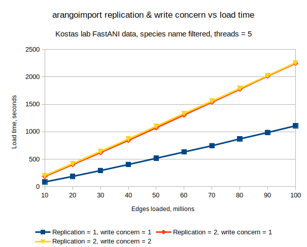

# Test with 2x replication, write concern = 1 or 2

[Test data setup](../create_test_data.md#100m-gca-id-edges-split-into-10m-chunks)

[Environment setup](../environment_setup.md#rebuild-docker-image-again-to-reduce-size)

Example run with replication = 1, write concern = 1
```
In [6]: files = !ls data/NCBI_Prok-matrix.txt.gz.GCAonly.head*-*M.key.txt.gz

In [8]: ret = run_imports(files, 5)
***data/NCBI_Prok-matrix.txt.gz.GCAonly.head0-10M.key.txt.gz***
***data/NCBI_Prok-matrix.txt.gz.GCAonly.head10-20M.key.txt.gz***
***data/NCBI_Prok-matrix.txt.gz.GCAonly.head20-30M.key.txt.gz***
***data/NCBI_Prok-matrix.txt.gz.GCAonly.head30-40M.key.txt.gz***
***data/NCBI_Prok-matrix.txt.gz.GCAonly.head40-50M.key.txt.gz***
***data/NCBI_Prok-matrix.txt.gz.GCAonly.head50-60M.key.txt.gz***
***data/NCBI_Prok-matrix.txt.gz.GCAonly.head60-70M.key.txt.gz***
***data/NCBI_Prok-matrix.txt.gz.GCAonly.head70-80M.key.txt.gz***
***data/NCBI_Prok-matrix.txt.gz.GCAonly.head80-90M.key.txt.gz***
***data/NCBI_Prok-matrix.txt.gz.GCAonly.head90-100M.key.txt.gz***

In [10]: ret
Out[10]: 
[{'time': 86.81573224067688, 'disk': 949347892, 'index': 1167781464},
 {'time': 101.16269755363464, 'disk': 1352009429, 'index': 1792281278},
 {'time': 106.16566228866577, 'disk': 1754879599, 'index': 2360931803},
 {'time': 109.93988513946533, 'disk': 2102285551, 'index': 2735284083},
 {'time': 113.78973937034607, 'disk': 2387373687, 'index': 3199688078},
 {'time': 114.59047746658325, 'disk': 2893977967, 'index': 3682897303},
 {'time': 113.77107119560242, 'disk': 3273406214, 'index': 4041828143},
 {'time': 123.94383144378662, 'disk': 3596679860, 'index': 4450177119},
 {'time': 116.43767976760864, 'disk': 3952700237, 'index': 4931605652},
 {'time': 122.76644206047058, 'disk': 4408017533, 'index': 5446271927}]

In [11]: print_res(ret)
|Docs loaded (M)|Cumulative time (s)|Cumulative disk size (B)|Cumulative index size (B)|
|---|---|---|---|
|10|86.81573224067688|949347892|1167781464|
|20|187.97842979431152|1352009429|1792281278|
|30|294.1440920829773|1754879599|2360931803|
|40|404.0839772224426|2102285551|2735284083|
|50|517.8737165927887|2387373687|3199688078|
|60|632.464194059372|2893977967|3682897303|
|70|746.2352652549744|3273406214|4041828143|
|80|870.179096698761|3596679860|4450177119|
|90|986.6167764663696|3952700237|4931605652|
|100|1109.3832185268402|4408017533|5446271927|
```

## Replication 1, write concern = 1

```
In [10]: ret
Out[10]: 
[{'time': 86.81573224067688, 'disk': 949347892, 'index': 1167781464},
 {'time': 101.16269755363464, 'disk': 1352009429, 'index': 1792281278},
 {'time': 106.16566228866577, 'disk': 1754879599, 'index': 2360931803},
 {'time': 109.93988513946533, 'disk': 2102285551, 'index': 2735284083},
 {'time': 113.78973937034607, 'disk': 2387373687, 'index': 3199688078},
 {'time': 114.59047746658325, 'disk': 2893977967, 'index': 3682897303},
 {'time': 113.77107119560242, 'disk': 3273406214, 'index': 4041828143},
 {'time': 123.94383144378662, 'disk': 3596679860, 'index': 4450177119},
 {'time': 116.43767976760864, 'disk': 3952700237, 'index': 4931605652},
 {'time': 122.76644206047058, 'disk': 4408017533, 'index': 5446271927}]
 ```

|Docs loaded (M)|Cumulative time (s)|Cumulative disk size (B)|Cumulative index size (B)|
|---|---|---|---|
|10|86.81573224067688|949347892|1167781464|
|20|187.97842979431152|1352009429|1792281278|
|30|294.1440920829773|1754879599|2360931803|
|40|404.0839772224426|2102285551|2735284083|
|50|517.8737165927887|2387373687|3199688078|
|60|632.464194059372|2893977967|3682897303|
|70|746.2352652549744|3273406214|4041828143|
|80|870.179096698761|3596679860|4450177119|
|90|986.6167764663696|3952700237|4931605652|
|100|1109.3832185268402|4408017533|5446271927|

## Replication 2, write concern = 1

```
In [9]: ret
Out[9]: 
[{'time': 187.63442873954773, 'disk': 827101724, 'index': 981185771},
 {'time': 215.33341908454895, 'disk': 1085746407, 'index': 1475026269},
 {'time': 218.79501628875732, 'disk': 1503111098, 'index': 2018335206},
 {'time': 222.90910935401917, 'disk': 1870773853, 'index': 2379575805},
 {'time': 228.29527640342712, 'disk': 2221447246, 'index': 2757545106},
 {'time': 233.11459732055664, 'disk': 2685796111, 'index': 3232485568},
 {'time': 233.15758442878723, 'disk': 3031608167, 'index': 3777998414},
 {'time': 235.30174851417542, 'disk': 3515258033, 'index': 4203683176},
 {'time': 240.15702867507935, 'disk': 3723252997, 'index': 4698533660},
 {'time': 231.10766696929932, 'disk': 4072413844, 'index': 5129758976}]
```

|Docs loaded (M)|Cumulative time (s)|Cumulative disk size (B)|Cumulative index size (B)|
|---|---|---|---|
|10|187.63442873954773|827101724|981185771|
|20|402.9678478240967|1085746407|1475026269|
|30|621.762864112854|1503111098|2018335206|
|40|844.6719734668732|1870773853|2379575805|
|50|1072.9672498703003|2221447246|2757545106|
|60|1306.081847190857|2685796111|3232485568|
|70|1539.2394316196442|3031608167|3777998414|
|80|1774.5411801338196|3515258033|4203683176|
|90|2014.698208808899|3723252997|4698533660|
|100|2245.8058757781982|4072413844|5129758976|

## Replication 2, write concern = 1 run 2
Seems weird that the write concern doesn't affect the run time

```
[{'time': 188.29836058616638, 'disk': 644996268, 'index': 942502894},
 {'time': 217.9730761051178, 'disk': 988736888, 'index': 1390410832},
 {'time': 220.25408267974854, 'disk': 1390263951, 'index': 1821187303},
 {'time': 227.48054265975952, 'disk': 1734315395, 'index': 2187608952},
 {'time': 227.4465687274933, 'disk': 2118902105, 'index': 2585875079},
 {'time': 234.03539204597473, 'disk': 2527914818, 'index': 3162113656},
 {'time': 238.6825532913208, 'disk': 2836360297, 'index': 3610589263},
 {'time': 232.67825150489807, 'disk': 3219608093, 'index': 4143948055},
 {'time': 238.14066314697266, 'disk': 3626280333, 'index': 4616433525},
 {'time': 240.3454999923706, 'disk': 3888144478, 'index': 5052566303}]
```

|Docs loaded (M)|Cumulative time (s)|Cumulative disk size (B)|Cumulative index size (B)|
|---|---|---|---|
|10|188.29836058616638|644996268|942502894|
|20|406.2714366912842|988736888|1390410832|
|30|626.5255193710327|1390263951|1821187303|
|40|854.0060620307922|1734315395|2187608952|
|50|1081.4526307582855|2118902105|2585875079|
|60|1315.4880228042603|2527914818|3162113656|
|70|1554.170576095581|2836360297|3610589263|
|80|1786.8488276004791|3219608093|4143948055|
|90|2024.9894907474518|3626280333|4616433525|
|100|2265.3349907398224|3888144478|5052566303|


## Replication 2, write concern = 2

```
In [14]: ret
Out[14]: 
[{'time': 202.84811568260193, 'disk': 791070725, 'index': 1036492066},
 {'time': 219.01715087890625, 'disk': 1050555342, 'index': 1312254228},
 {'time': 221.07375836372375, 'disk': 1511362413, 'index': 1864033328},
 {'time': 226.06171917915344, 'disk': 1847668738, 'index': 2317275687},
 {'time': 232.40011930465698, 'disk': 2159771737, 'index': 2693763483},
 {'time': 232.5830192565918, 'disk': 2517824849, 'index': 3224745190},
 {'time': 225.28864288330078, 'disk': 2898331481, 'index': 3717340008},
 {'time': 231.02699995040894, 'disk': 3203535008, 'index': 4083733890},
 {'time': 233.80236911773682, 'disk': 3686826765, 'index': 4567129658},
 {'time': 232.3505344390869, 'disk': 3909801576, 'index': 4994828412}]
```

|Docs loaded (M)|Cumulative time (s)|Cumulative disk size (B)|Cumulative index size (B)|
|---|---|---|---|
|10|202.84811568260193|791070725|1036492066|
|20|421.8652665615082|1050555342|1312254228|
|30|642.9390249252319|1511362413|1864033328|
|40|869.0007441043854|1847668738|2317275687|
|50|1101.4008634090424|2159771737|2693763483|
|60|1333.9838826656342|2517824849|3224745190|
|70|1559.272525548935|2898331481|3717340008|
|80|1790.2995254993439|3203535008|4083733890|
|90|2024.1018946170807|3686826765|4567129658|
|100|2256.4524290561676|3909801576|4994828412|

## Graphs




Note: I assume that the API is only reporting the non-replicated data size.

