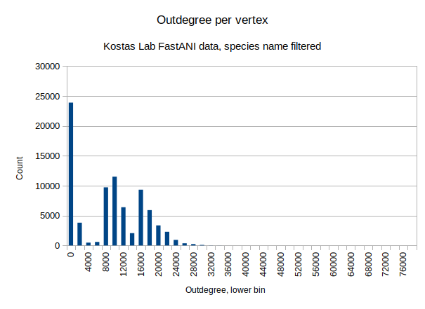
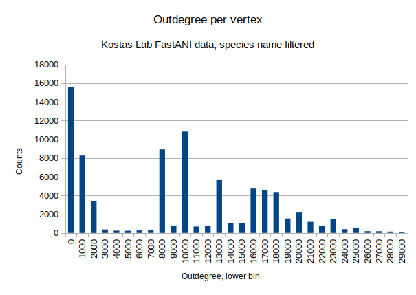
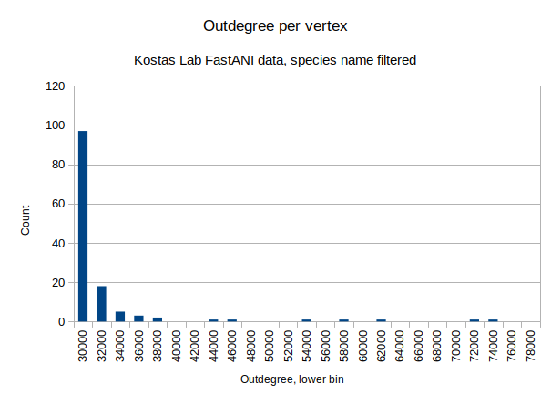

# Distribution of vertex outdegree

[Test data setup](./create_test_data.md#790m-gca-edges)


## Calculations
```
root@1bf971c2965d:/arangobenchmark# ipython
Python 3.10.4 (main, May 28 2022, 13:14:58) [GCC 10.2.1 20210110]
Type 'copyright', 'credits' or 'license' for more information
IPython 8.4.0 -- An enhanced Interactive Python. Type '?' for help.

In [1]: import gzip

In [2]: from collections import defaultdict

In [3]: freqs = defaultdict(int)

In [4]: with gzip.open('data/NCBI_Prok-matrix.txt.gz.GCAonly.txt.gz', 'rt') as infile:
   ...:     for line in infile:
   ...:         name1, name2, score, key = line.split(',')
   ...:         freqs[name1.strip()] += 1
   ...: 

In [5]: len(freqs)
Out[5]: 81013

In [6]: sum(freqs.values())
Out[6]: 790191759

In [8]: import json

In [10]: with open('data/frequencies.json', 'w') as f:
    ...:     f.write(json.dumps(freqs, indent=4))
    ...: 
```

```
}root@1bf971c2965d:/arangobenchmark# ipython
Python 3.10.4 (main, May 28 2022, 13:14:58) [GCC 10.2.1 20210110]
Type 'copyright', 'credits' or 'license' for more information
IPython 8.4.0 -- An enhanced Interactive Python. Type '?' for help.

In [1]: import json

In [2]: with open('data/frequencies.json') as f:
   ...:     freqs = json.loads(f.read())
   ...: 

In [3]: max(freqs.values()
   ...: )
Out[3]: 75746

In [6]: import statistics

In [7]: statistics.mean(freqs.values())
Out[7]: 9753.888375939665

In [8]: statistics.median(freqs.values())
Out[8]: 10297

In [9]: statistics.stdev(freqs.values())
Out[9]: 7599.63757456699
```

Histogram creation:

```
root@41ef399393aa:/arangobenchmark# ipython
Python 3.10.4 (main, May 28 2022, 13:14:58) [GCC 10.2.1 20210110]
Type 'copyright', 'credits' or 'license' for more information
IPython 8.4.0 -- An enhanced Interactive Python. Type '?' for help.

In [1]: import json

In [2]: with open('data/frequencies.json') as f:
   ...:     freqs = json.loads(f.read())
   ...: 

In [3]: len(freqs)
Out[3]: 81013

In [4]: import numpy as np

In [9]: res = np.histogram(list(freqs.values()), bins=40, range=(0,80000))

In [10]: for i in res[0]:
    ...:     print(i)
    ...: 
23882
3814
482
593
9717
11508
6394
2059
9327
5914
3361
2290
935
371
234
97
18
5
3
2
0
0
1
1
0
0
0
1
0
1
0
1
0
0
0
0
1
1
0
0

In [11]: res = np.histogram(list(freqs.values()), bins=30, range=(0,30000))

In [12]: for i in res[0]:
    ...:     print(i)
    ...: 
15618
8264
3438
376
247
235
269
324
8921
796
10821
687
749
5645
1014
1045
4741
4586
4368
1546
2173
1188
787
1503
403
532
191
180
149
85

In [13]: res = np.histogram(list(freqs.values()), bins=20, range=(0,1000))

In [14]: for i in res[0]:
    ...:     print(i)
    ...: 
7633
1136
731
785
727
550
408
437
589
152
987
810
113
88
103
92
75
64
72
68

In [15]: res = np.histogram(list(freqs.values()), bins=20, range=(0,20))

In [16]: for i in res[0]:
    ...:     print(i)
    ...: 
0
950
618
639
453
447
409
347
289
235
280
131
186
171
100
103
112
121
121
160
```

## Graphs




## High outdegree vertices

```
root@2ccd79c28269:/arangobenchmark# ipython
Python 3.10.4 (main, May 28 2022, 13:14:58) [GCC 10.2.1 20210110]
Type 'copyright', 'credits' or 'license' for more information
IPython 8.4.0 -- An enhanced Interactive Python. Type '?' for help.

In [1]: import json

In [2]: with open('data/frequencies.json') as infile:
   ...:     freqs = json.loads(infile.read())
   ...: 

In [3]: len(freqs)
Out[3]: 81013

In [4]: topfreqs = {k: freqs[k] for k in freqs if freqs[k] > 40000}

In [5]: len(topfreqs)
Out[5]: 7

In [7]: noedges = [k for k in freqs if freqs[k] == 0]

In [8]: len(noedges)
Out[8]: 0

In [9]: topfreqs
Out[9]: 
{'GCA_000817745': 75746,
 'GCA_000817775': 45981,
 'GCA_001990805': 63946,
 'GCA_000934435': 72457,
 'GCA_000285855': 55288,
 'GCA_001751265': 46665,
 'GCA_000230485': 58568}
```
```
root@2ccd79c28269:/arangobenchmark# ipython
Python 3.10.4 (main, May 28 2022, 13:14:58) [GCC 10.2.1 20210110]
Type 'copyright', 'credits' or 'license' for more information
IPython 8.4.0 -- An enhanced Interactive Python. Type '?' for help.

In [1]: import json

In [2]: with open('data/frequencies.json') as infile:
   ...:     freqs = json.loads(infile.read())
   ...: 

In [3]: topfreqs = {k: freqs[k] for k in freqs if freqs[k] > 40000}

In [4]: len(topfreqs)
Out[4]: 7

In [6]: import gzip

In [7]: from collections import defaultdict

In [12]: names = defaultdict(set)

In [13]: with gzip.open('data/NCBI_Prok-matrix.txt.gz', 'rt') as infile:
    ...:     for line in infile:
    ...:         name1, name2, score = line.split()
    ...:         for gcaid in topfreqs:
    ...:             if gcaid in name1:
    ...:                 names[gcaid].add(name1)

In [14]: len(names)
Out[14]: 7

In [15]: for v in names.values():
    ...:     print(len(v))
    ...: 
1
1
1
1
1
1
1

In [18]: for gca, count in sorted(topfreqs.items(), key=lambda x: x[1]):
    ...:     print(next(iter(names[gca])), count)
    ...: 
Lyngbya_confervoides_BDU141951_GCA_000817775.LargeContigs.fna 45981
Streptomyces_nanshensis_GCA_001751265.LargeContigs.fna 46665
Ruminococcus_sp__JC304_GCA_000285855.LargeContigs.fna 55288
uncultured_marine_crenarchaeote__Gulf_of_Maine__GCA_000230485.LargeContigs.fna 58568
Mastigocladus_laminosus_74_GCA_001990805.LargeContigs.fna 63946
Mastigocladus_laminosus_UU774_GCA_000934435.LargeContigs.fna 72457
Aphanocapsa_montana_BDHKU210001_GCA_000817745.LargeContigs.fna 75746
```

|ID|Outdegree / total vertices|
|--|--|
|Lyngbya_confervoides_BDU141951_GCA_000817775.LargeContigs.fna|45981 / 81013|
|Streptomyces_nanshensis_GCA_001751265.LargeContigs.fna|46665 / 81013|
|Ruminococcus_sp__JC304_GCA_000285855.LargeContigs.fna|55288 / 81013|
|uncultured_marine_crenarchaeote__Gulf_of_Maine__GCA_000230485.LargeContigs.fna|58568 / 81013|
|Mastigocladus_laminosus_74_GCA_001990805.LargeContigs.fna|63946 / 81013|
|Mastigocladus_laminosus_UU774_GCA_000934435.LargeContigs.fna|72457 / 81013|
|Aphanocapsa_montana_BDHKU210001_GCA_000817745.LargeContigs.fna|75746 / 81013|

Sanity check:
```
root@2ccd79c28269:/arangobenchmark/data# gunzip -c NCBI_Prok-matrix.txt.gz | grep Aphanocapsa_montana_BDHKU210001_GCA_000817745.LargeContigs.fna | wc -l
83575
```